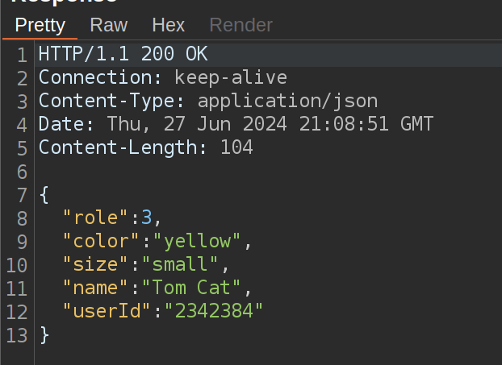

## Lesson 2

Antes de comenzar el ataque, nos piden iniciar sesión con las siguientes credenciales:

- Usuario: `tom`
- Contraseña: `cat`

## Lesson 3

### Desarrollo

Debemos capturar la respuesta HTTP de la petición que se realiza al hacer clic en el botón "View Profile" del usuario "Tom" y analizar que información sensible se encuentra en la respuesta.

En el front disponemos de la siguiente información tras una consulta exitos:

```
name:Tom Cat
color:yellow
size:small
```

### Solución

Podemos utilizar varias herramientas para capturar la respuesta HTTP, como Burp Suite, Fiddler, o simplemente el inspector de red del navegador.

La información que devuelve el servidor es la siguiente:



Podemos observar que hay campos que no estan presentes en el front, estos son `role` y `userId`.

