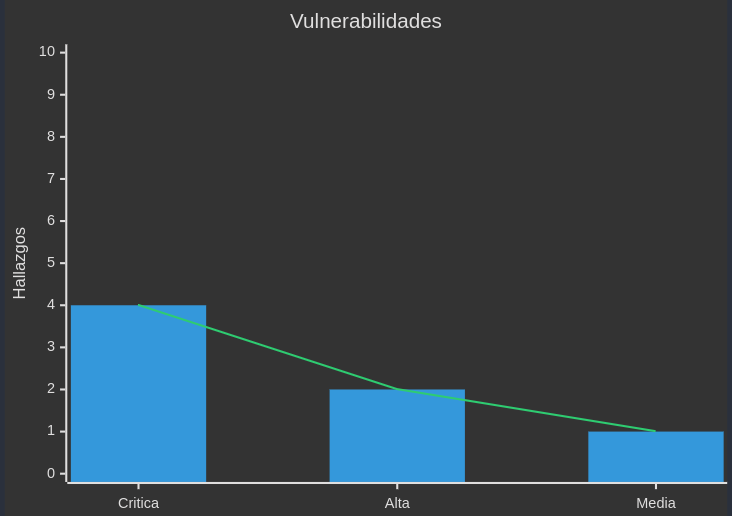

## Conclusiones

De las vulnerabilidades analizadas, 4 son críticas, 2 son de alta severidad y 1 es de severidad media. Se identificaron violaciones de principios de seguridad como la autenticación y autorización, la confidencialidad, la integridad y la disponibilidad de la información. Se recomienda aplicar las mitigaciones propuestas en cada una de las vulnerabilidades para mejorar la seguridad de la aplicación web.

{ width=60% }

{ width=60% }

