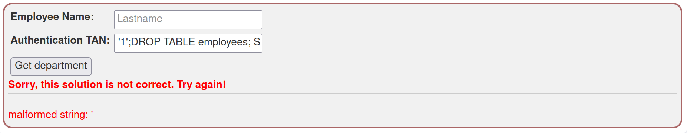

### Inyección de SQL

- Categoria de la vulnerabilidad: A03:2021 – Injection
- CWE: [CWE-89](https://cwe.mitre.org/data/definitions/89.html)
- CVSS: 9.8
- [Resolución de Ejercicios en WebGoat](../A3-SQL-injection.md)

#### Descripción

Durante la auditoría se detectó que la aplicación web es vulnerable a inyección de SQL. Un atacante podría inyectar código SQL en los campos de texto de la aplicación y obtener información sensible de la base de datos.

#### Explotación de la vulnerabilidad

En los campos `Employee Name` y `Employee ID` se pueden inyectar sentencias SQL para obtener información de la base de datos.

Si ingresamos `3SL99A' or '1'='1` como id de empleado, la consulta final inyectada sería:

```sql
SELECT * FROM employees WHERE last_name='Smith' AND auth_tan='3SL99A' or '1'='1'
```

En cuanto al nombre del empleado, da igual el valor ingresado, siempre devolverá la lista completa de empleados.


#### Post-explotación

Una vez que el atacante obtiene acceso a la base de datos, puede realizar consultas adicionales para obtener información sensible, como credenciales de usuarios, información de salarios o departamentos.

Adicionalmente, el usuario podría modificar o eliminar registros de la base de datos, lo que podría causar daños irreparables a la organización.

Entradas como las siguientes:

```sql
3SL99A' or '1'='1'; -- 
3SL99A' or '1'='1'; DROP TABLE employees; --
3SL99A' or '1'='1'; UPDATE employees SET salary=10000000 WHERE last_name='Smith';--
```

Son ejemplos de consultas que un atacante podría realizar para obtener información sensible o causar daños a la base de datos.

Explotación de los principios CIA vulnerados:

##### Confidencialidad


##### Integridad


##### Disponibilidad



#### Posibles mitigaciones

Para mitigar esta vulnerabilidad, se recomienda utilizar consultas parametrizadas en lugar de concatenar directamente los valores ingresados por el usuario en las consultas SQL.

Además, se recomienda validar y sanitizar las entradas de los usuarios antes de ejecutar cualquier consulta en la base de datos.

#### Referencias
- [CWE-89: Improper Neutralization of Special Elements used in an SQL Command ('SQL Injection')](https://cwe.mitre.org/data/definitions/89.html)
- [OWASP: SQL Injection](https://owasp.org/www-community/attacks/SQL_Injection)
- [SQL Injection Cheat Sheet](https://portswigger.net/web-security/sql-injection/cheat-sheet)
- [SQL Injection Prevention Cheat Sheet](https://cheatsheetseries.owasp.org/cheatsheets/SQL_Injection_Prevention_Cheat_Sheet.html)

