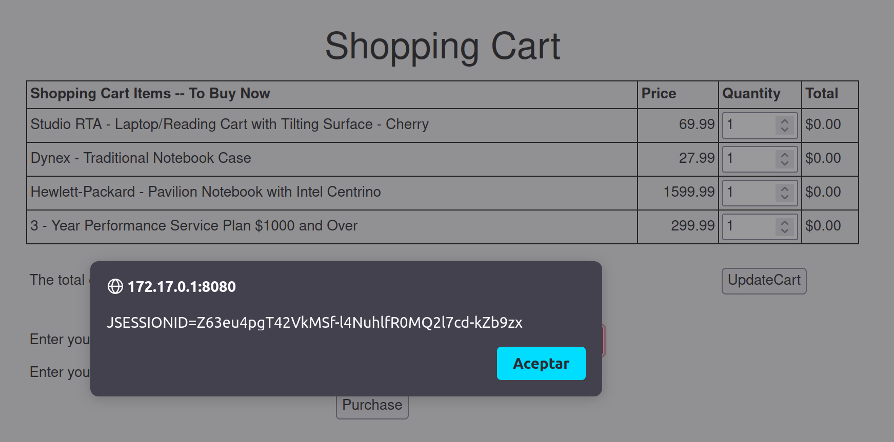
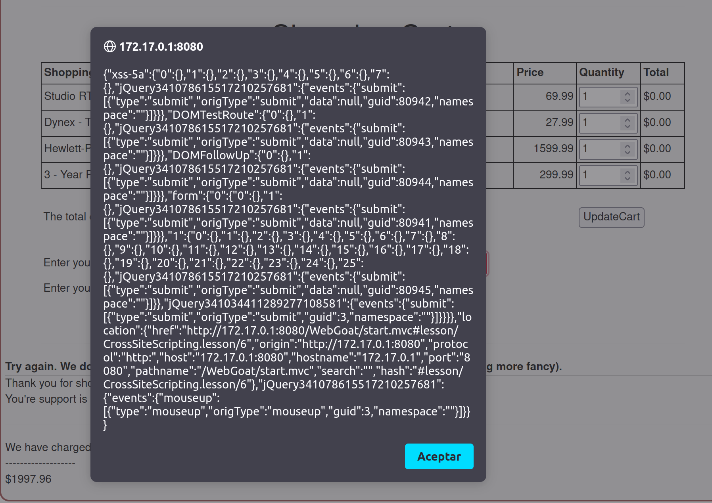

## Cross Site Scripting (XSS)

- Categoría de la vulnerabilidad: A07:2021 – Cross Site Scripting (XSS)
- CWE: [CWE-79](https://cwe.mitre.org/data/definitions/79.html)
- #CVSS:3.1/AV:N/AC:L/PR:N/UI:N/S:U/C:H/I:N/A:N (Alto)

### Descripción

Durante la auditoría se detectó que la aplicación web es vulnerable a Cross Site Scripting (XSS). Un atacante podría inyectar código JavaScript en los campos de texto de la aplicación y ejecutarlo en el navegador de otros usuarios u obtener información sensible de la sesión como cookies o credenciales.

### Explotación de la vulnerabilidad

En el campo para la tarjeta de crédito, se puede inyectar código JavaScript para obtener información sensible de la sesión del usuario.

Si ingresamos el siguiente código en el campo de la tarjeta de crédito:

```html
<script>alert("hola mundo")</script>
```

Podemos inyectar exitosamente código JavaScript en la aplicación web.


### Post-explotación

Una vez que el atacante ha inyectado código JavaScript en la aplicación web, puede realizar diferentes acciones maliciosas como:

- Obtener acceso a diferentes elementos de la página web.

```html
<script>alert(document.cookie)</script>
<script>alert(JSON.stringify(localStorage))</script>
<script>alert(JSON.stringify(sessionStorage))</script>
```

Exposiciones de información:




- Redireccionar a una página maliciosa.

```html
<script>window.location.href = "http://www.paginamaliciosa.com"</script>
```

### Posibles mitigaciones

Para mitigar esta vulnerabilidad, se recomienda:

- Validar y sanitizar las entradas de los usuarios antes de mostrarlas en la página web.
- Utilizar funciones de escape de caracteres especiales para evitar la ejecución de código JavaScript.
- Implementar Content Security Policy (CSP) para limitar los orígenes de los scripts que se pueden ejecutar en la página web.
- Utilizar el atributo `HttpOnly` en las cookies para evitar que sean accedidas por código JavaScript.
- Utilizar el atributo `SameSite` en las cookies para limitar el envío de cookies en peticiones cross-site.

### Referencias

- [OWASP: Cross Site Scripting (XSS)](https://owasp.org/www-community/attacks/xss/)
- [Cross Site Scripting Cheat Sheet](https://portswigger.net/web-security/cross-site-scripting/cheat-sheet)
- [Cross Site Scripting Prevention Cheat Sheet](https://cheatsheetseries.owasp.org/cheatsheets/Cross_Site_Scripting_Prevention_Cheat_Sheet.html)
- [CWE-79: Improper Neutralization of Input During Web Page Generation ('Cross-site Scripting')](https://cwe.mitre.org/data/definitions/79.html)
- [OWASP: Content Security Policy (CSP)](https://owasp.org/www-project-secure-headers/)
- [SameSite cookies explained](https://web.dev/samesite-cookies-explained/)
- [SameSite cookies: Lax by default](https://web.dev/samesite-cookies-explained/#lax-by-default)
