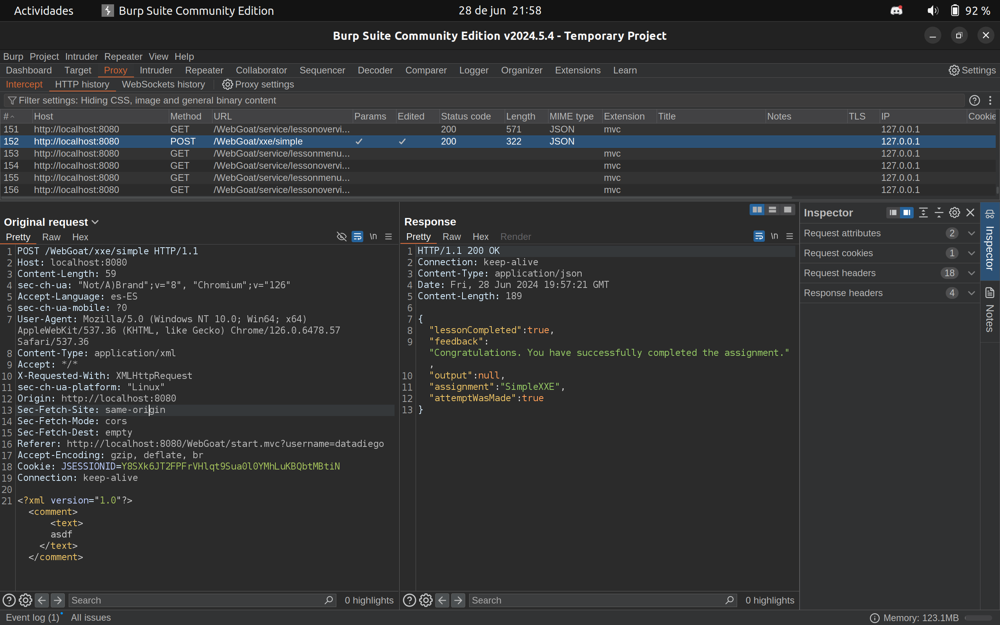
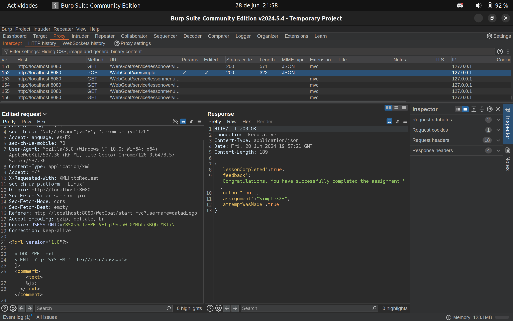

## Security Misconfiguration (XXE)

- Categoría de la vulnerabilidad: A05:2021 – Security Misconfiguration
- CWE: [CWE-611](https://cwe.mitre.org/data/definitions/611.html)
- [Resolución de Ejercicios en WebGoat](../A5-XEE-injection.md)

### Descripción

Durante la auditoría se detectó que la aplicación web es vulnerable a External Entity Injection (XEE). Un atacante podría inyectar entidades externas en los archivos XML de la aplicación.

### Explotación de la vulnerabilidad

Podemos capturar la solicitud con Burp Suite y modificar el XML para inyectar código malicioso. Podemos inyectar código para listar el contenido de un archivo en el servidor:

```xml
<?xml version="1.0"?>
<!DOCTYPE text [
  <!ENTITY js SYSTEM "file:///">
]>
<comment>  
    <text>
        &js;
    </text>
</comment>
```

Petición original:



Petición modificada:



### Post-explotación

Una vez que el atacante ha inyectado código malicioso en el XML, puede realizar diferentes acciones maliciosas como:

- Listar el contenido de archivos en el servidor.
- Obtener información sensible del sistema.
- Realizar ataques de denegación de servicio (DoS) al servidor.

### Posibles mitigaciones

Para mitigar esta vulnerabilidad, se recomienda:

- Deshabilitar la resolución de entidades externas en los archivos XML.
- Validar y sanitizar las entradas de los usuarios antes de procesar los archivos XML.
- Utilizar un parser XML seguro que no permita la resolución de entidades externas.

### Referencias

- [OWASP: XML External Entity (XXE) Processing](https://owasp.org/www-community/vulnerabilities/XML_External_Entity_(XXE)_Processing)
- [CWE-611: Improper Restriction of XML External Entity Reference](https://cwe.mitre.org/data/definitions/611.html)
- [XML External Entity (XXE) Cheat Sheet](https://portswigger.net/web-security/xxe)
- [XML External Entity (XXE) Injection](https://owasp.org/www-community/attacks/XML_External_Entity_(XXE)_Processing)

