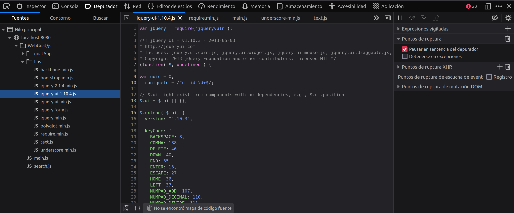

## Componentes no actualizados

- Categoria: A06:2021 – Outdated Components
- CVE: [CVE-2019-11358](https://nvd.nist.gov/vuln/detail/CVE-2019-11358)
- #CVSS:3.1/AV:N/AC:L/PR:N/UI:N/S:U/C:L/I:N/A:N (Media)

### Descripción

Durante la auditoría se detectó que la aplicación web utiliza componentes con versiones desactualizadas. Un atacante podría aprovechar vulnerabilidades conocidas en las versiones antiguas de los componentes para comprometer la seguridad de la aplicación.

La versión de jquery utilizada en la aplicación web es vulnerable a [CVE-2019-11358](https://nvd.nist.gov/vuln/detail/CVE-2019-11358), que permite a un atacante ejecutar código JavaScript malicioso en el navegador de los usuarios.

### Explotación de la vulnerabilidad

Acceder a las librerías usadas en el frontend es accesible desde el propio navegador, por lo que un atacante podría identificar la versión de jquery utilizada en la aplicación web y buscar vulnerabilidades conocidas en esa versión.



Un atacante podría aprovechar la vulnerabilidad en la versión de jquery para inyectar código JavaScript malicioso en la aplicación web. Por ejemplo, si el atacante inyecta el siguiente código en un campo de texto:

```html
<script>alert("hola mundo")</script>
```


El código JavaScript se ejecutará en el navegador de los usuarios que visiten la página web.

### Recomendación

Se recomienda actualizar los componentes de la aplicación web a las versiones más recientes para mitigar el riesgo de explotación de vulnerabilidades conocidas. Además, se recomienda implementar un proceso de gestión de vulnerabilidades para mantener actualizados los componentes de la aplicación web.

### Referencias

- [CVE-2019-11358](https://nvd.nist.gov/vuln/detail/CVE-2019-11358)
- [OWASP Top 10 2017 - A9: Using Components with Known Vulnerabilities](https://owasp.org/www-project-top-ten/2017/A9_2017-Using_Components_with_Known_Vulnerabilities)