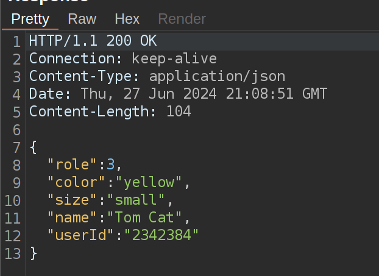
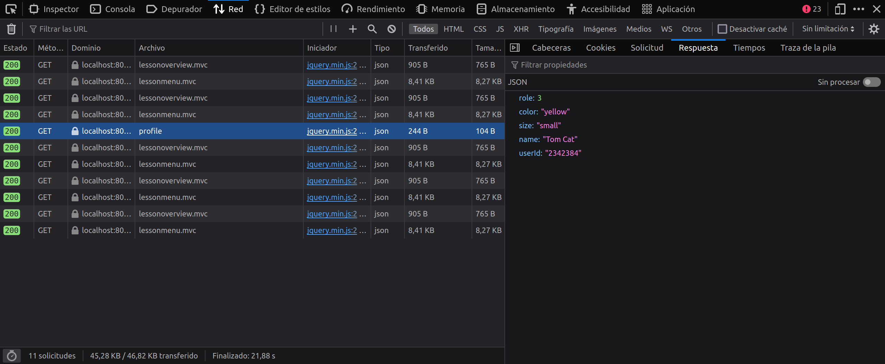
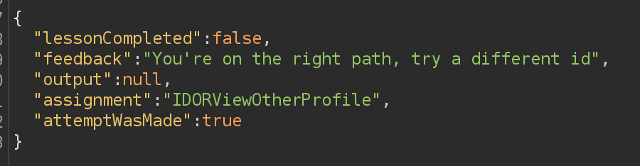
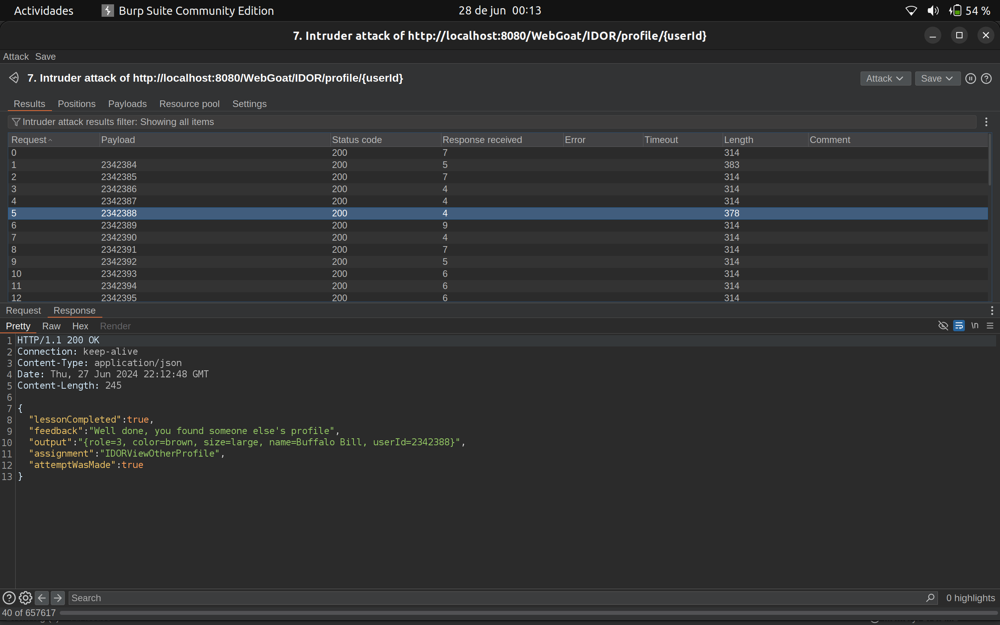
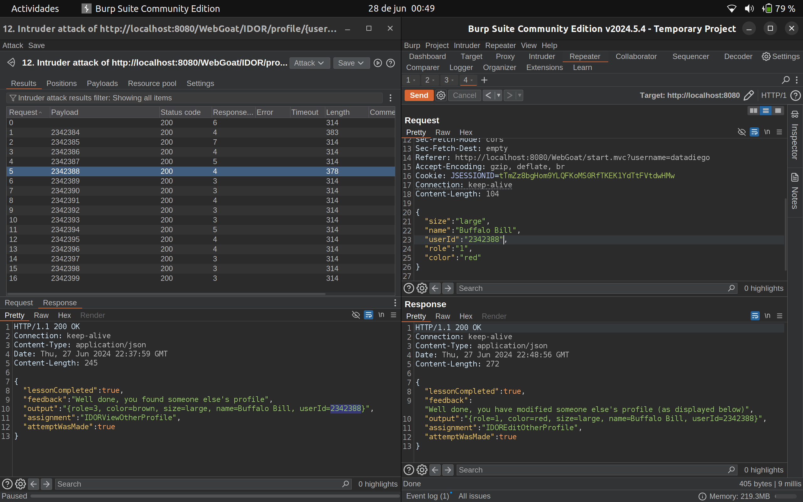

## IDOR (Insecure Direct Object Reference)

- Categoría de la vulnerabilidad: A01:2021 – Broken Access Control
- CWE: [CWE-639](https://cwe.mitre.org/data/definitions/639.html)
- #CVSS:3.1/AV:N/AC:L/PR:N/UI:N/S:C/C:H/I:H/A:H (Crítico)

### Descripción

Durante la auditoría se detectó el envío de información sensible en las solicitudes HTTP, lo que permite a un atacante acceder a información acerca de la gestión de usuarios de la aplicación web y, finalmente, a recursos protegidos de otros usuarios.

La vulnerabilidad rompe los principios de seguridad de la información de confidencialidad e integridad y dispone de un impacto crítico en la aplicación web.

### Explotación de la vulnerabilidad

Un atacante podría aprovechar la vulnerabilidad de IDOR para acceder a recursos protegidos de otros usuarios.

Podemos capturar la solicitud GET mediante un proxy web como Burp Suite o leerla directamente desde el navegador.

{ width=60% }

{ width=60% }

### Post-explotación

Un atacante puede acceder a recursos protegidos de otros usuarios, como información personal, datos sensibles, o realizar acciones en nombre de otros usuarios modificando la solicitud GET.

{ width=60% }

Podemos hacer fuzzing en la solicitud GET para identificar recursos protegidos de otros usuarios.

{ width=60% }

\newpage

Y finalmente modificar la solicitud GET por un POST para modificar recursos protegidos de otros usuarios.

{ width=60% }

### Recomendaciones

Limitar el tipo de peticiones HTTP que se pueden realizar a los recursos de la aplicación web y validar la autorización de los usuarios en cada solicitud desde el servidor.

### Referencias

- [OWASP - Insecure Direct Object References](https://owasp.org/www-community/attacks/Insecure_Direct_Object_References)
- [OWASP - Top 10 2017 - A4:2017-Insecure Direct Object References](https://owasp.org/www-project-top-ten/2017/A4_2017-Insecure_Direct_Object_References)
