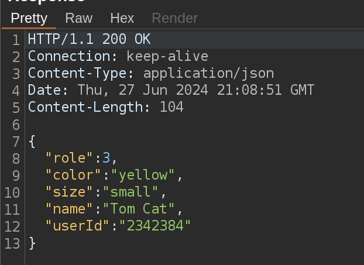
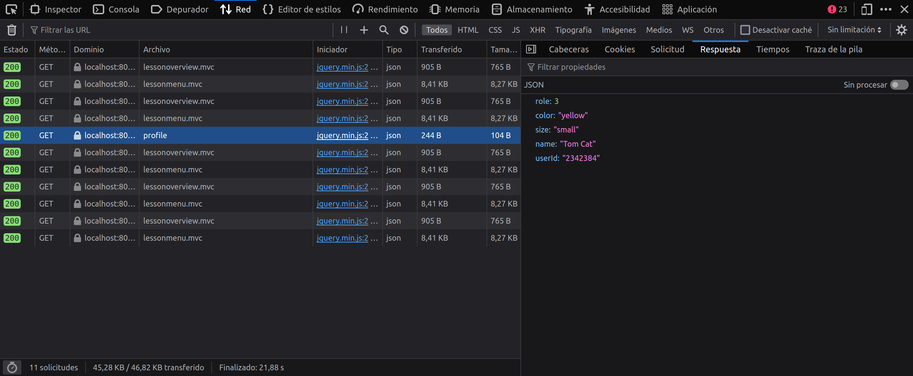
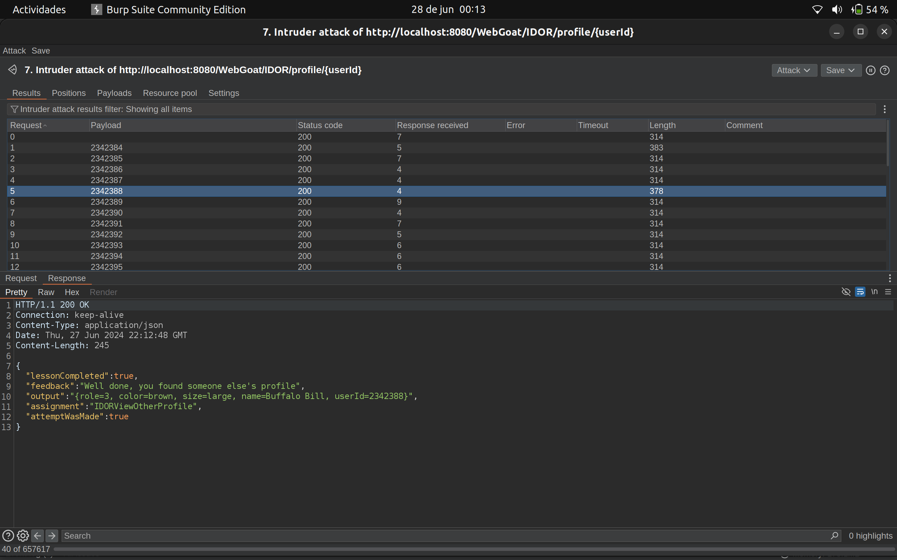

## IDOR (Insecure Direct Object Reference)

La auditoría de seguridad de la aplicación web detectó una vulnerabilidad de Insecure Direct Object Reference (IDOR) en la funcionalidad de gestión de usuarios. Un atacante podría aprovechar esta vulnerabilidad para acceder a recursos protegidos de otros usuarios sin autorización.

### Descripción

Durante la auditoría se detectó el envío de información sensible en las solicitudes HTTP, lo que permite a un atacante acceder a información acerca de la gestión de usuarios de la aplicación web y, finalmente, a recursos protegidos de otros usuarios.

La vulnerabilidad rompe los principios de seguridad de la información de confidencialidad e integridad y dispone de un impacto crítico en la aplicación web.

### Explotación de la vulnerabilidad

Un atacante podría aprovechar la vulnerabilidad de IDOR para acceder a recursos protegidos de otros usuarios.

Podemos capturar la solicitud GET mediante un proxy web como Burp Suite o leerla directamente desde el navegador.

### Post-explotación

Un atacante puede acceder a recursos protegidos de otros usuarios, como información personal, datos sensibles, o realizar acciones en nombre de otros usuarios modificando la solicitud GET.

Podemos hacer fuzzing en la solicitud GET para identificar recursos protegidos de otros usuarios.

Y finalmente modificar la solicitud GET por un POST para modificar recursos protegidos de otros usuarios.

### Recomendaciones

Limitar el tipo de peticiones HTTP que se pueden realizar a los recursos de la aplicación web y validar la autorización de los usuarios en cada solicitud desde el servidor.

### Referencias

- [OWASP - Insecure Direct Object References](https://owasp.org/www-community/attacks/Insecure_Direct_Object_References)
- [OWASP - Top 10 2017 - A4:2017-Insecure Direct Object References](https://owasp.org/www-project-top-ten/2017/A4_2017-Insecure_Direct_Object_References)
