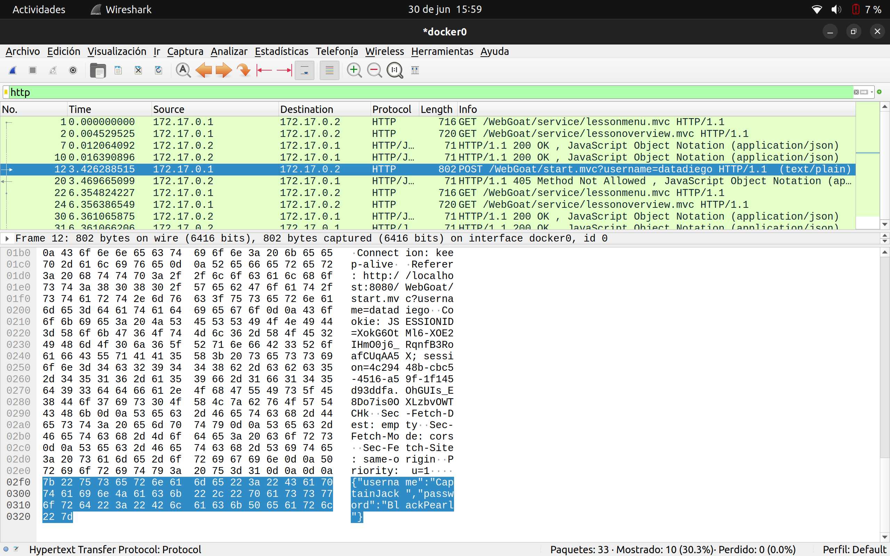

# Login inseguro

- Categoria de la vulnerabilidad: A07:2021-Identification and Authentication Failures
- CWE: [CWE-287](https://cwe.mitre.org/data/definitions/287.html)
- [Resolución de Ejercicios en WebGoat](../A7-Insecure-login.md)

## Descripción

Durante la auditoría se detectó que la aplicación web no tiene HTTPS habilitado en la página de login, lo que permite a un atacante interceptar las credenciales de los usuarios.

### Explotación de la vulnerabilidad

Utilizando un proxy web como Burp Suite, o un analizador de protocolos como WireShrak podemos capturar las credenciales de los usuarios al momento de autenticarse en la aplicación web.

### Post-explotación

Una vez que el atacante ha capturado las credenciales de los usuarios, puede realizar diferentes acciones maliciosas como:

- Acceder a la cuenta de los usuarios.
- Realizar acciones en nombre de los usuarios.
- Obtener información sensible de la sesión de los usuarios.
- Realizar ataques de phishing.
- Escalar privilegios en la aplicación web si las credenciales capturadas pertenecen a un usuario con privilegios elevados.
- Realizar ataques de fuerza bruta para obtener las credenciales de otros usuarios.
- Comprometer la confidencialidad e integridad de la información de los usuarios.

### Posibles mitigaciones

Para mitigar esta vulnerabilidad, se recomienda:

- Habilitar HTTPS en la página de login y en toda la aplicación web.
- Implementar un mecanismo de autenticación seguro, como OAuth2 o OpenID Connect.
- Utilizar un mecanismo de autenticación multifactor (MFA) para proteger las cuentas de los usuarios.
- Validar y sanitizar las entradas de los usuarios antes de procesarlas en la aplicación web.
- Implementar un mecanismo de bloqueo de cuentas después de varios intentos fallidos de autenticación.

### Referencias

- [OWASP: Authentication Cheat Sheet](https://owasp.org/www-community/cheat-sheets/Authentication_Cheat_Sheet)
- [OWASP: Top 10 2017 - A2:2017-Broken Authentication](https://owasp.org/www-project-top-ten/2017/A2_2017-Broken_Authentication)
- [CWE-287: Improper Authentication](https://cwe.mitre.org/data/definitions/287.html)