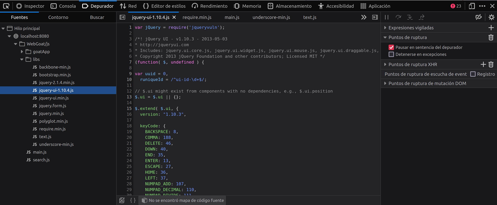

## Information Gathering

El escaneo de servicios muestra el siguiente resultado:

```plaintext
Starting Nmap 7.94SVN ( https://nmap.org ) at 2024-06-28 16:52 CEST
Nmap scan report for localhost (127.0.0.1)
Host is up (0.00040s latency).
Not shown: 997 closed tcp ports (conn-refused)
PORT     STATE SERVICE     VERSION
22/tcp   open  ssh         OpenSSH 9.7p1 Debian 5 (protocol 2.0)
8080/tcp open  http-proxy
9090/tcp open  zeus-admin?
2 services unrecognized despite returning data.
```

Nos devuelve dos fingerprints de servicios en los puertos 8080 y 9090. El servicio en el puerto 8080 parece ser un servidor web, mientras que el servicio en el puerto 9090 no se puede identificar. Nikto tampoco ha podido identificar el servidor web en el puerto 8080.

Nikto nos devuelve el siguiente analisis:
```
- Nikto v2.1.5
---------------------------------------------------------------------------
+ Target IP:          172.17.0.2
+ Target Hostname:    172.17.0.2
+ Target Port:        8080
+ Start Time:         2024-06-29 09:21:21 (GMT2)
---------------------------------------------------------------------------
+ Server: No banner retrieved
+ The anti-clickjacking X-Frame-Options header is not present.
+ 6544 items checked: 0 error(s) and 1 item(s) reported on remote host
+ End Time:           2024-06-29 09:21:38 (GMT2) (17 seconds)
---------------------------------------------------------------------------
+ 1 host(s) tested
```

Detectamos dos servicios en los puertos 8080 y 9090. El servicio en el puerto 8080 parece ser un servidor web, mientras que el servicio en el puerto 9090 no se puede identificar. Nikto tampoco ha podido identificar el servidor web en el puerto 8080.

\newpage

En el frontend de la aplicación web encontramos las siguientes librerias:

```js
jquery: 'libs/jquery.min',
jqueryvuln: 'libs/jquery-2.1.4.min',
jqueryuivuln: 'libs/jquery-ui-1.10.4',
jqueryui: 'libs/jquery-ui.min',
underscore: 'libs/underscore-min',
backbone: 'libs/backbone-min',
bootstrap: 'libs/bootstrap.min',
text: 'libs/text',
templates: 'goatApp/templates',
polyglot: 'libs/polyglot.min',
search: 'search'
```


